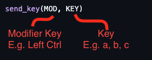

# HIDPi
## About This Project
This project focuses on a simple way to set up a Raspberry Pi 4B (and maybe others) as a USB HID device. 

I created this because I was getting really annoyed about the lack of info on using Pis other than the Zero as USB HID devices. There are many posts that mention doing it, but they never seem to work. There are also many posts saying only the Pico or Zero can do it.

I've tested it on a Raspberry Pi 4B 8GB model from 2018, running Raspberry Pi OS lite (32-bit), Debian Bookworm. It probably works on 64-bit but I haven't tried it yet.

## Install

### 2 Commands
Simply run this (you may have to run `sudo apt upgrade -y` after `sudo apt update`)
```sh
sudo apt update && sudo apt install libusb-1.0-0-dev libudev-dev -y && curl https://raw.githubusercontent.com/rikka-chunibyo/HIDPi/refs/heads/master/code/HIDPi_Setup.py -o HIDPi_Setup.py && sudo python3 HIDPi_Setup.py
```
It will reboot itself, and that's all! Take a look at [Usage](#usage) for an example on how to use HIDPi

### Casual
Or if you want to go through it yourself (you may have to run `sudo apt upgrade -y` after `sudo apt update`)
```sh
sudo apt update
sudo apt install libusb-1.0-0-dev libudev-dev -y
curl https://raw.githubusercontent.com/rikka-chunibyo/HIDPi/refs/heads/master/code/HIDPi_Setup.py -o HIDPi_Setup.py
sudo python3 HIDPi_Setup.py
```
It will reboot itself, and that's all! Take a look at [Usage](#usage) for an example on how to use HIDPi

### Manual
If you're looking to run each individual command in the Python installer, follow this guide [HIDPi_Setup.md](https://github.com/rikka-chunibyo/HIDPi/refs/heads/master/markdowns/HIDPi_Setup.md).

### Troubleshooting and Customizing the Install
If the install fails for whatever reason you can try installing it by following the AI-generated guide [HIDPi_Setup.md](https://github.com/rikka-chunibyo/HIDPi/refs/heads/master/markdowns/HIDPi_Setup.md), I have no clue if it's right, I didn't bother making it myself because the script hasn't failed for me. If the guide doesn't work feel free to create an issue and I'll rewrite it myself.

If you want to edit the reported device details, just edit these using nano before running the script. If using the tutorial you can easily change them before copying the commands.
https://github.com/rikka-chunibyo/HIDPi/blob/5d8923c2a563fd5d4f914b0e31c02b067eabf2c9/code/HIDPi_Setup.py#L75-L77

If `/dev/hidg0` doesn't exist, make sure to check under different numbers. If it still doesn't exist, more likely than not, something went wrong with the service, check the logs with this
```sh
journalctl -xeu HIDPi
```
It should look something like this
```
Feb 28 02:10:30 rikka python3[1914]: Creating systemd service...
Feb 28 02:10:30 rikka python3[1914]: HIDPi service installed. It will run on next boot.
Feb 28 02:10:30 rikka python3[1914]: Config already modified.
Feb 28 02:10:30 rikka python3[1914]: Setting up HID gadget...
Feb 28 02:10:30 rikka python3[1914]: Error: /bin/sh: 1: echo: echo: I/O error
Feb 28 02:10:30 rikka python3[1914]: Error: /bin/sh: 1: echo: echo: I/O error
Feb 28 02:10:30 rikka python3[1914]: Error: /bin/sh: 1: echo: echo: I/O error
Feb 28 02:10:30 rikka python3[1914]: Error: cat: write error: Device or resource busy
Feb 28 02:10:30 rikka python3[1914]: Error: ln: failed to create symbolic link '/sys/kernel/config/usb_gadget/hid_g>
Feb 28 02:10:30 rikka python3[1914]: Error: ls: write error: Device or resource busy
Feb 28 02:10:30 rikka python3[1914]: Creating udev rule for hidg...
Feb 28 02:10:30 rikka python3[1914]: Udev rules reloaded.
Feb 28 02:10:30 rikka python3[1914]: HIDPi Initialized
Feb 28 02:10:30 rikka systemd[1]: HIDPi.service: Deactivated successfully.
░░ Subject: Unit succeeded
░░ Defined-By: systemd
░░ Support: https://www.debian.org/support
░░
░░ The unit HIDPi.service has successfully entered the 'dead' state.
```
It's okay to have those errors, if anything more than that fails, and you don't know how to resolve it, create an issue with the logs. It's okay to have what is shown faling in my log to fail, I just didn't make it stop trying those on reboot, which could have some benifits like fixing itself if something corrupts or gets deleted ¯\_(ツ)_/¯ All it's doing is rerunning the installer via a service on startup.

## Usage
Since it's so basic of an implementation (seriously why can't I find another repo on this that just works???), the code is slightly more in-depth then your common HID libraries, but it's still really simple. I'll probably make a library for it soon which literally just removes the need to manually add the keys.

Here's an example
https://github.com/rikka-chunibyo/HIDPi/blob/b5fe1766aa82766922e7c5726ed853d6a31ec3b1/code/Example_Usage.py#L1-L20

Sendkey format is very simple



Just have to convert it using [this](https://usb.org/sites/default/files/documents/hut1_12v2.pdf#10%20Keyboard/Keypad%20Page%20(0x07)) table ([backup](https://github.com/rikka-chunibyo/HIDPi/refs/heads/master/assets/hut1_12v2.pdf) page 53)

## Issues
I usually respond fast, I honestly don't know much about all of this, I just scrapped together some commands and stuff, but I'll try my best to help. 

If there's an issue while your using a different OS, please open an issue about adding support for it, I'd like this project to be as plug-and-play and simple as possible.

Not really about issues but if you have any suggestions for improvements or anything feel free to open a discussion about it.
